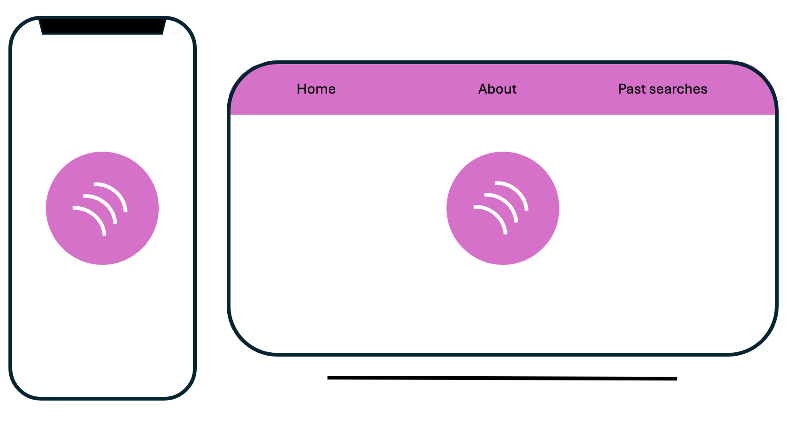

# AI Project

## Planning

### Ideas
- Facial Recognition
- Detect danger
    - Checks for dangerous items/hazards
    - Rates the scene on a scale of 0 - 1
- Recognise songs from an artist(s)

### Final Choice 
Recognise songs from an artist(s)

[^ How Shazam Works](https://bs-uploads.toptal.io/blackfish-uploads/components/blog_post_page/4086035/cover_image/regular_1708x683/cover-0220-HowShazamWork-Waldek_img-ecb571a5e6643bc9b33aed536d2f6c0e.png)

### The problem
We need to create a novel and enjoyable music recognition system to detect and classify songs from users favourite artits. 

Primarily designed for spontaneous use to help the user identify a song they can't quite remember the name of.

### Stakeholders
Our application would be primarily for avid music listeners who are particularly interested in updating and adding to playlists.

In terms of age range and demographic, our target audience would stretch to everyone who listens to music or for anyone capable of listening to music.

### Research
Simmilar solutions to this problem include
- [Shazam](https://www.shazam.com/)
- [AHA Music Recognition](https://www.aha-music.com/identify-songs-music-recognition-online)
- [Google "hum to search"](https://blog.google/products/search/hum-to-search/)

Shazam - owned by Apple - is the most popular solution to music recognition with one of the largest databases for music recognition. They have integration with apple music and are embedded into many iPhones out-of-the-box

### Features
- Primary Features
    - Must be able to distinguish, with a high enough accuracy, the correct song
    - Must have at least 25 songs 
    - Should run locally
- Extension Features
    - Can recognise patterns between songs to recommend new ones
    - Can extend its database by scraping youtube (will need to check tos and permission)
    - Could keep track of the amount of people who looked up the song

## Design
### Structure
The program would be able to recognise songs using a prebuilt ai training program [TeachableMachine](https://teachablemachine.withgoogle.com), but the model would be created by us. We would train it by feeding it a few songs at the start until it can confidently detect the difference between a few songs & background noise. Then, only at this point, we can get more songs into the dataset, and even support mp3 inputs for new songs added to the model.

### User Interface
Simplistic and minimalistic design

Greater detail analysis 

### Decomposition
- Detect Audio
    - Ask for permission
        - Automatically handled by client
    - Get audio
        - Get stream (Audio Buffer) from [Web Audio API](https://developer.mozilla.org/en-US/docs/Web/API/Web_Audio_API)

- Change bar size
    - Get audio sample (past timeframe e.g. 1 second)
    - Split audio sample into frames
        - Split into 5 (or however many bars are chosen) frames
    - Calculate mean of frame
        - Take height of each 1ms and find mean of all
    - Return bar size (fixed to min and max bar size)

- Detect song
    - Get audio input
    - Compare with model
    - Record the percentage accuracy for 10 seconds
    - Return the most likely song (highest mean percentage accuracy)

### Algorithms

Inputs:
- Audio Buffer

Outputs:
- Bar Height Array

In calculating the bar height for the next frame, we don't reference to the previous frame at all, making each bar height independent of each other and therefore simplifying the inputs and inner workings.

One of the inputs is the audio buffer, which is a mean value of amplitude of sound within a given time frame. This is the raw input that we use as the main variable to calculate the resulting bar height. In the function, we'd probably have a for loop to calculate the height of each bar and return it in the only output variable, bar height array. Each iteration of the for loop pushes a new value to 

### Test data
| Function Call | Input | Outputs | Data Type |
| -- | -- | -- | -- |
| **ChangeBars()** | 0.1, 0.347, 0.98 | 0, 1 | 'hello', 9.6, ['a', 'b', 'c'] |